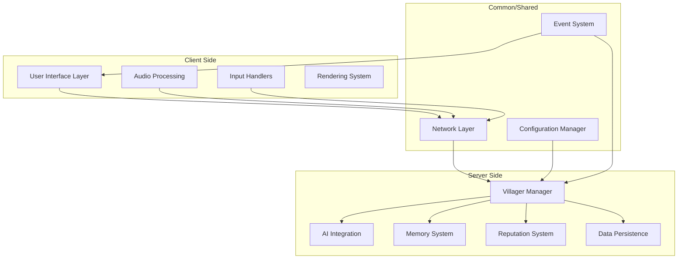

# Design Document

## Overview

The Voice of the Village mod transforms villager interactions in Minecraft by enabling voice and text communication powered by AI. The system consists of several interconnected components: villager data management, communication interfaces, AI integration, audio processing, reputation tracking, and configuration management. The design emphasizes modularity, performance, and seamless integration with vanilla Minecraft mechanics.

## Architecture

### High-Level Architecture



### Component Interaction Flow

1. **Input Capture**: Client captures voice/text input from player
2. **Network Communication**: Input sent to server via custom packets
3. **Villager Processing**: Server processes input through AI and memory systems
4. **Response Generation**: AI generates contextual response based on villager personality and history
5. **Audio Synthesis**: Server generates audio response (if voice input was used)
6. **Client Playback**: Response sent back to client for display/playback

## Components and Interfaces

### 1. Configuration System

**Purpose**: Manages all mod settings and provides runtime configuration updates.

**Key Classes**:
- `VoiceConfig`: Main configuration class using NeoForge's config system
- `ConfigValidator`: Validates configuration values and provides defaults

**Configuration Structure**:
```java
public class VoiceConfig {
    // Interaction modes and distances
    public static final BooleanValue ADVANCED_MODE;
    public static final DoubleValue INTERACTION_DISTANCE; // Default: 10.0, -1 = disabled, 0 = infinite
    public static final DoubleValue NAME_TAG_DISTANCE; // Default: 5.0
    
    // AI Integration
    public static final StringValue AI_API_KEY;
    public static final StringValue AI_PROVIDER; // OpenAI, Anthropic, etc.
    public static final StringValue AI_MODEL;
    
    // Memory and Reputation
    public static final IntValue MEMORY_RETENTION_DAYS; // Default: 30
    
    // Audio Settings
    public static final BooleanValue ENABLE_VOICE_INPUT;
    public static final BooleanValue ENABLE_VOICE_OUTPUT;
    public static final StringValue PUSH_TO_TALK_KEY; // Default: "V"
}
```

### 2. Villager Data Management

**Purpose**: Extends villager entities with custom data for names, personalities, memories, and reputation.

**Key Classes**:
- `VillagerDataManager`: Manages villager-specific data
- `VillagerPersonality`: Defines personality traits and voice characteristics
- `VillagerMemory`: Stores and retrieves interaction history
- `VillagerReputation`: Tracks player-villager relationship status

**Data Structure**:
```java
public class VillagerData {
    private String name;
    private Gender gender;
    private PersonalityType personality;
    private Map<UUID, ReputationData> playerReputations;
    private List<InteractionMemory> memories;
    private long lastInteractionTime;
}

public class InteractionMemory {
    private UUID playerId;
    private String playerMessage;
    private String villagerResponse;
    private long timestamp;
    private InteractionType type; // VOICE, TEXT, TRADE
}
```

### 3. Communication Interfaces

**Purpose**: Handles different modes of player-villager communication.

#### Simple Mode Interface
- **GUI Integration**: Extends villager trading screen with communication panel
- **Components**: Text input field, voice record button, conversation history
- **Activation**: Right-click interaction with villager

#### Advanced Mode Interface
- **Push-to-Talk System**: Configurable key binding for voice activation
- **Command System**: `/voice <villagerName> "message"` command
- **Visual Feedback**: Speaking indicator overlay
- **Target Selection**: Raycast-based villager targeting

**Key Classes**:
- `VillagerCommunicationScreen`: Extended trading GUI with communication features
- `VoiceInputHandler`: Manages voice input capture and processing
- `VoiceCommand`: Handles text-based communication commands
- `SpeakingIndicator`: Renders speaking status overlay

### 4. AI Integration Layer

**Purpose**: Interfaces with external AI services to generate contextual responses.

**Key Classes**:
- `AIServiceManager`: Manages different AI provider implementations
- `AIProvider`: Abstract base class for AI service implementations
- `OpenAIProvider`, `AnthropicProvider`: Specific AI service implementations
- `PromptBuilder`: Constructs context-aware prompts for AI services

**AI Context Building**:
```java
public class AIContext {
    private VillagerData villagerData;
    private PlayerData playerData;
    private List<InteractionMemory> recentMemories;
    private String currentMessage;
    private GameContext gameContext; // Time, location, nearby entities
}
```

**Response Processing**:
- Content filtering for appropriate responses
- Personality consistency enforcement
- Minecraft-context awareness
- Response length optimization

### 5. Audio Processing System

**Purpose**: Handles voice input capture, processing, and text-to-speech output.

**Key Classes**:
- `AudioCaptureManager`: Captures microphone input
- `SpeechToTextProcessor`: Converts audio to text
- `TextToSpeechProcessor`: Converts text responses to audio
- `VoiceProfileManager`: Manages different voice profiles for villagers

**Audio Pipeline**:
1. **Input Capture**: Record audio from microphone
2. **Noise Reduction**: Basic audio cleanup
3. **Speech Recognition**: Convert to text using external service
4. **Response Generation**: AI processes text and generates response
5. **Voice Synthesis**: Convert response text to speech with appropriate voice
6. **Audio Playback**: Play generated audio on client

**Voice Characteristics**:
- Gender-based voice selection
- Personality-influenced speech patterns
- Natural-sounding synthesis
- Configurable voice speed and pitch

### 6. Memory and Persistence System

**Purpose**: Stores and manages villager memories and player interactions.

**Key Classes**:
- `MemoryManager`: Handles memory storage and retrieval
- `DataPersistence`: Manages saving/loading villager data
- `MemoryCleanup`: Removes expired memories based on configuration

**Storage Strategy**:
- **File-based**: JSON files for each villager's data
- **Memory Management**: Automatic cleanup of old interactions
- **Backup System**: Regular backups of villager data
- **Migration Support**: Handle data format changes between mod versions

### 7. Reputation and Behavior System

**Purpose**: Tracks player-villager relationships and triggers behavioral responses.

**Key Classes**:
- `ReputationManager`: Calculates and updates reputation scores
- `BehaviorTrigger`: Handles reputation-based actions
- `IronGolemSpawner`: Manages "hired help" spawning

**Reputation Mechanics**:
```java
public class ReputationData {
    private int score; // Range: -100 to +100
    private List<ReputationEvent> events;
    private long lastUpdate;
}

public enum ReputationThreshold {
    HOSTILE(-80),    // Spawn iron golem
    UNFRIENDLY(-40), // Attack player once
    NEUTRAL(0),      // Normal behavior
    FRIENDLY(40),    // Positive interactions
    BELOVED(80);     // Special benefits
}
```

### 8. Network Communication

**Purpose**: Handles client-server communication for voice and text data.

**Key Packets**:
- `VoiceInputPacket`: Sends voice data from client to server
- `TextMessagePacket`: Sends text messages
- `VillagerResponsePacket`: Sends responses back to client
- `ReputationUpdatePacket`: Updates client with reputation changes

**Security Considerations**:
- Input validation and sanitization
- Rate limiting for API calls
- Secure handling of API keys
- Prevention of spam/abuse

## Data Models

### Villager Extended Data
```java
@Entity
public class ExtendedVillagerData {
    @Id
    private UUID villagerId;
    
    @Column
    private String originalName;
    
    @Column
    private String customName; // From name tags
    
    @Column
    private Gender gender;
    
    @Column
    private PersonalityType personality;
    
    @OneToMany(cascade = CascadeType.ALL)
    private List<InteractionMemory> memories;
    
    @OneToMany(cascade = CascadeType.ALL)
    private Map<UUID, ReputationData> playerReputations;
}
```

### Name Generation System
```java
public class NameGenerator {
    private static final List<String> MALE_NAMES = Arrays.asList(
        "Alexander", "Benjamin", "Christopher", "Daniel", "Edward",
        "Frederick", "George", "Henry", "Isaac", "James", "Kenneth",
        "Lawrence", "Michael", "Nicholas", "Oliver", "Patrick"
    );
    
    private static final List<String> FEMALE_NAMES = Arrays.asList(
        "Alice", "Beatrice", "Catherine", "Diana", "Eleanor",
        "Florence", "Grace", "Helen", "Isabella", "Julia", "Katherine",
        "Louise", "Margaret", "Natalie", "Olivia", "Patricia"
    );
}
```

## Error Handling

### AI Service Failures
- **Fallback Responses**: Pre-defined responses when AI is unavailable
- **Retry Logic**: Automatic retry with exponential backoff
- **Error Logging**: Detailed logging for debugging
- **User Notification**: Inform players when services are unavailable

### Audio Processing Errors
- **Microphone Access**: Handle permission denials gracefully
- **Audio Format Issues**: Support multiple audio formats
- **Network Timeouts**: Handle slow speech processing services
- **Fallback to Text**: Allow text input when voice fails

### Data Persistence Errors
- **File Corruption**: Backup and recovery mechanisms
- **Disk Space**: Handle insufficient storage gracefully
- **Concurrent Access**: Prevent data corruption from multiple threads

## Testing Strategy

### Unit Testing
- **Configuration Validation**: Test all config value ranges and validation
- **Name Generation**: Verify random name generation and gender assignment
- **Reputation Calculations**: Test reputation score changes and thresholds
- **Memory Management**: Test memory storage, retrieval, and cleanup

### Integration Testing
- **AI Service Integration**: Mock AI services for consistent testing
- **Audio Pipeline**: Test complete voice input/output flow
- **Network Communication**: Test packet serialization/deserialization
- **GUI Integration**: Test communication interface with trading GUI

### Performance Testing
- **Memory Usage**: Monitor villager data storage efficiency
- **Network Bandwidth**: Test with multiple simultaneous conversations
- **AI Response Times**: Measure and optimize response latency
- **Audio Processing**: Test real-time audio processing performance

### Compatibility Testing
- **Mod Compatibility**: Test with popular villager-related mods
- **Version Compatibility**: Test across different Minecraft/NeoForge versions
- **Platform Testing**: Test on different operating systems
- **Hardware Testing**: Test with various audio hardware configurations

## Security and Privacy Considerations

### API Key Management
- Secure storage of API keys in configuration
- Warning messages about API costs and usage
- Rate limiting to prevent excessive API usage

### Data Privacy
- Local storage of all villager interaction data
- No transmission of personal data to external services
- Clear documentation of what data is sent to AI services

### Input Validation
- Sanitization of all user inputs
- Prevention of command injection through villager names
- Validation of audio data before processing